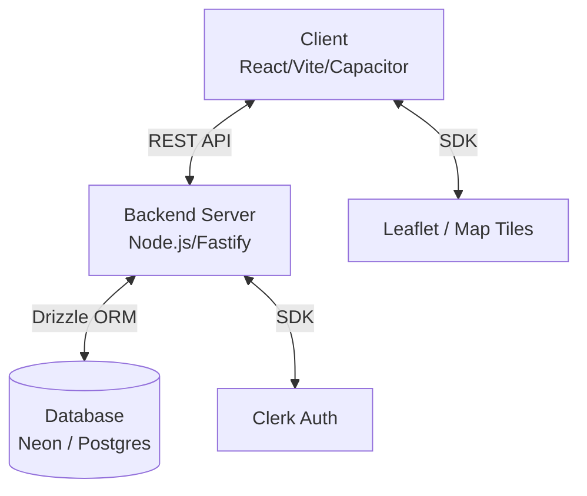

# FirstKnock Sales OS (Ghosteam v5)

## 📖 Overview

**FirstKnock Sales OS** is a comprehensive property canvassing and route management platform designed for real estate professionals. It allows users to visualize property data on interactive maps, filter targets by specific criteria (such as zip codes), and optimize canvassing routes for efficiency.

**Goal:** To provide a reliable, "Sales Operating System" that streamlines the process of identifying leads and managing field operations.

---

## 🏗️ Architecture

The application follows a modern **Client-Server architecture**, utilizing a robust frontend for visualization and a dedicated backend for data processing and storage.

### High-Level Diagram



### Components

#### 1. Frontend (Client)
A responsive web and mobile application built with **React** and **Vite**.
- **UI Framework:** TailwindCSS combined with Shadcn UI (Radix Primitives) for a premium, accessible design.
- **State Management:** TanStack Query for efficient server-state management.
- **Mobile Native:** Wrapped with **Capacitor** to deploy as native Android and iOS apps.
- **Mapping:** Integrated **Leaflet** maps for property visualization and route plotting.

#### 2. Backend (Server)
A high-performance API server built with **Node.js** and **Fastify**.
- **Language:** TypeScript for type safety and maintainability.
- **API:** RESTful endpoints for properties (`/api/properties`), routes (`/api/routes`), and zip codes.
- **Authentication:** Middleware utilizing **Clerk** to secure endpoints and manage user sessions.

#### 3. Database
A serverless Postgres database powered by **Neon**, managed via **Drizzle ORM**.
- **Key Tables:**
    - `properties`: Stores comprehensive property details (address, specs, sold date, smart score).
    - `saved_routes`: Persists user-created canvassing routes with performance metrics.
    - `zip_codes`: Geographic reference data.

---

## 🚀 Key Features

- **📍 Interactive Map Interface:** Visualize properties across specific regions with dynamic clustering and filtering.
- **🔍 Smart Filtering:** Search and filter properties by Zip Code to target specific territories.
- **🛣️ Route Optimization:** Create, save, and manage canvassing routes. The system calculates metrics like distance and property density.
- **📱 Cross-Platform:** Runs seamlessly in the browser and as a native mobile app on iOS and Android.
- **🔐 Secure Authentication:** Enterprise-grade authentication provided by Clerk.

---

## 🛠️ Getting Started

### Prerequisites
- **Node.js** (v18+ recommended)
- **Git**

### Installation

1. **Clone the Repository**
   ```bash
   git clone <repository_url>
   cd ghosteam-v5/firstknock-sales-os
   ```

2. **Install Frontend Dependencies**
   ```bash
   npm install
   ```

3. **Install Backend Dependencies**
   ```bash
   cd backend
   npm install
   cd ..
   ```

### Configuration

Create an `.env` file in both the root directory and the `backend` directory based on the `.env.example` (if provided) or the required keys below.

**Root `.env` (Frontend):**
```env
VITE_BASE44_APP_ID=<your_app_id>
VITE_BASE44_APP_BASE_URL=http://localhost:3000
VITE_CLERK_PUBLISHABLE_KEY=<your_clerk_key>
```

**Backend `.env`:**
```env
DATABASE_URL=<your_neon_db_url>
CLERK_SECRET_KEY=<your_clerk_secret>
PORT=3000
```

### Running Locally

1. **Start the Backend Server**
   ```bash
   cd backend
   npm run dev
   ```
   *Server will run on http://localhost:3000*

2. **Start the Frontend Application** (in a new terminal)
   ```bash
   npm run dev
   ```
   *App will run on http://localhost:5173*

---

## 📁 Project Structure

```
firstknock-sales-os/
├── src/                # Frontend Source Code
│   ├── components/     # Reusable UI Components
│   ├── pages/          # Application Pages/Routes
│   ├── lib/            # Utilities & Helpers
│   └── App.jsx         # Main App Entry Point
├── backend/            # Backend Source Code
│   ├── src/
│   │   ├── db/         # Database Schema & Client
│   │   ├── routes/     # API Route Definitions
│   │   └── index.ts    # Server Entry Point
├── android/            # Android Capacitor Project
├── ios/                # iOS Capacitor Project

## 👥 Team

- **Danny** ([@daannyyrod](https://github.com/daannyyrod)) - *Contributor*
- **Avion** - *Lead Developer*

