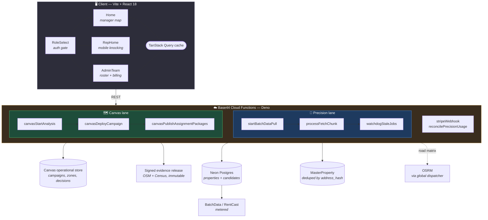
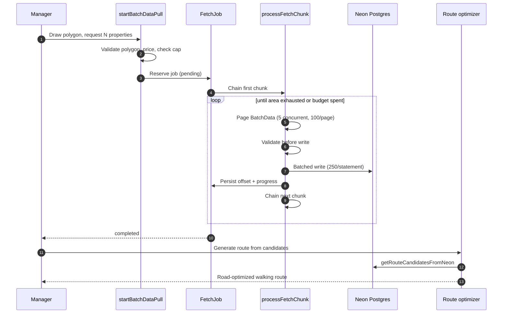
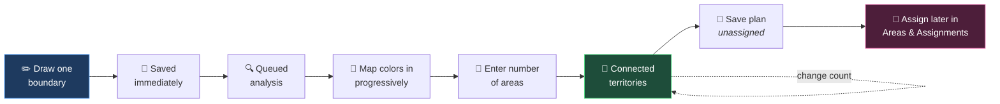

# FirstKnock Sales OS

> **Field intelligence for door-to-door sales teams.**
> Draw a boundary on a map. FirstKnock turns it into real, ownable work — verified sold-home leads on a road-optimized walking route, or connected residential territories split fairly across a crew — then puts it in every rep's pocket, online or off.

**Stack:** React 18 · Vite · TanStack Query · Leaflet · Base44 BaaS · Deno Cloud Functions · Stripe Billing  
**Data Providers:** BatchData API · RentCast API · OpenStreetMap · US Census · OSRM

<p align="left">
  
  
  
  
  
  
</p>

### Two ways to generate work

FirstKnock runs **two independent generation lanes**. They share the map, the roster, and billing — and nothing else. A failure in one cannot corrupt the other, and that isolation is enforced by tests.

|  | 🎯 **Precision** | 🗺️ **Canvas** |
|---|---|---|
| **Answers** | *Which specific homes just sold?* | *How do I split this whole area into fair territories?* |
| **Unit of work** | An individual verified property | A connected street-side territory |
| **Evidence** | BatchData / RentCast, paid per pull | OpenStreetMap + Census, precompiled |
| **Marginal cost** | Metered per property | Effectively zero once compiled |
| **Output** | An optimized walking route | Exclusive territories, one owner each |
| **Best for** | Chasing fresh sold-home signal | Standing up a full crew across a market |

---

## Table of Contents

1. [System Architecture](#system-architecture)
2. [Precision — Verified Property Generation](#precision--verified-property-generation)
3. [Canvas — Territory Generation](#canvas--territory-generation)
4. [Page-by-Page Feature Reference](#page-by-page-feature-reference)
5. [Cloud Functions Reference](#cloud-functions-reference)
6. [Data Entities & Schema](#data-entities--schema)
7. [Component Library Map](#component-library-map)
8. [Local Development](#local-development)
9. [Environment Variables](#environment-variables)

---

## System Architecture


```mermaid
flowchart TB
    subgraph Client["🖥️  Client — Vite + React 18"]
        direction LR
        RS["RoleSelect<br/><i>auth gate</i>"] --> HOME["Home<br/><i>manager map</i>"]
        RS --> REP["RepHome<br/><i>mobile knocking</i>"]
        RS --> ADMIN["AdminTeam<br/><i>roster + billing</i>"]
        HOME & REP & ADMIN --- TQ(["TanStack Query cache"])
    end

    subgraph Backend["☁️  Base44 Cloud Functions — Deno"]
        direction LR
        subgraph P["🎯 Precision lane"]
            SBP["startBatchDataPull"] --> PFC["processFetchChunk"]
            PFC --> WD["watchdogStaleJobs"]
        end
        subgraph C["🗺️ Canvas lane"]
            CSA["canvasStartAnalysis"] --> CDC["canvasDeployCampaign"]
            CDC --> CPA["canvasPublishAssignmentPackages"]
        end
        BILL["stripeWebhook<br/>reconcilePrecisionUsage"]
    end

    Client -->|REST| Backend

    P --> NEON[("Neon Postgres<br/><i>properties + candidates</i>")]
    C --> OPS[("Canvas operational store<br/><i>campaigns, zones, decisions</i>")]
    P --> MP[("MasterProperty<br/><i>deduped by address_hash</i>")]

    NEON --> BD["BatchData / RentCast<br/><i>metered</i>"]
    C --> EV["Signed evidence release<br/><i>OSM + Census, immutable</i>"]
    P -. road matrix .-> OSRM["OSRM<br/><i>via global dispatcher</i>"]

    style P fill:#1e3a5f,stroke:#4a9eff,color:#fff
    style C fill:#1e4d3a,stroke:#4ade80,color:#fff
    style Client fill:#2d2d3a,stroke:#8b8ba7,color:#fff
    style Backend fill:#3a2d1e,stroke:#d4a04a,color:#fff
```

**The two lanes never touch.** Precision writes properties and routes; Canvas writes campaigns, zones, and decisions. Canvas holds no `SavedRoute` or `Property` reference, and Precision map layers are suppressed in Canvas mode — both guarded by `test/canvas-precision-isolation.test.mjs`.

### Authentication & Routing Flow

1. User authenticates via Base44 Auth (email/password or OAuth).
2. `pages.config.js` sets `mainPage: "RoleSelect"` — the entry point.
3. `RoleSelect.jsx` checks `user.app_role`:
   - **No role yet** → Shows role selection cards (Manager / Join Team via invite code).
   - **`manager`** → Auto-redirect to `Home` (territory dashboard).
   - **`rep`** → Auto-redirect to `RepHome` (knock tab).
4. All pages are wrapped in `Layout.jsx` which provides the global navigation sidebar.

---

## Precision — Verified Property Generation

Precision answers **"which specific homes just sold in this area?"** Every property costs money to verify, so the entire lane is built around *not wasting a call* and *never writing an unverified record*.

### Order → job → route


```mermaid
sequenceDiagram
    autonumber
    participant M as Manager
    participant S as startBatchDataPull
    participant J as FetchJob
    participant C as processFetchChunk
    participant N as Neon Postgres
    participant R as Route optimizer

    M->>S: Draw polygon, request N properties
    S->>S: Validate polygon, price, check cap
    S->>J: Reserve job (pending)
    J->>C: Chain first chunk
    loop until area exhausted or budget spent
        C->>C: Page BatchData (5 concurrent, 100/page)
        C->>C: Validate before write
        C->>N: Batched write (250/statement)
        C->>J: Persist offset + progress
        C->>C: Chain next chunk
    end
    J-->>M: completed
    M->>R: Generate route from candidates
    R->>N: getRouteCandidatesFromNeon
    R-->>M: Road-optimized walking route
```

**Job lifecycle:** `pending → running → completed | failed | cancelled`. Only `pending` and `running` count as active, which is what stops a manager from stacking duplicate paid pulls on one area.

**Why it chunks.** A single invocation gets a **45-second provider scan budget** and a ceiling of **2,500 selected records**. When either runs out, the chunk persists its offset and chains the next invocation. A 24,000-record metro therefore completes across many chunks instead of silently stopping at an arbitrary ceiling. `watchdogStaleJobs` settles anything that dies mid-flight, and a `PipelineLock` with an 8-minute TTL keeps two chunks off the same job.

**Cost protection.** Property caps are enforced server-side per billing period — a free tier ceiling and a substantially larger paid ceiling — with reservation math persisted on the `FetchJob` so progress and billing cannot drift apart. `getPrecisionUsage` and `reconcilePrecisionUsage` keep Stripe and delivered work reconciled.

### Road-aware route optimization

Once candidates exist, the route has to be *walkable*, not merely short in a straight line.

| Module | Job |
|---|---|
| `roadMatrix.js` | Real driving/walking cost matrix via OSRM |
| `roadMatrixTiers.js` | Bounds the matrix at street-block level past the proven door limit |
| `roadAwareStreetSweep.js` | Orders blocks the way a person actually walks a street |
| `roadHierarchySequencer.js` | Two-level cluster → intra-cluster sequencing for large routes |
| `osrmDispatcher.js` | One global gate in front of every OSRM call |

The matrix cost is quadratic in both directions — 250 doors is ~36 OSRM requests, 1,000 doors is ~484, 2,000 is ~1,936. Past the proven door limit the route used to drop to aerial ordering while still being *labelled* optimized. `roadMatrixTiers` removes that silent cliff by putting one representative door per block into the matrix, so inter-block legs stay real. `osrmDispatcher` exists because the two-level hierarchy fires dozens of concurrent matrices; it enforces a global cap, spacing, and bounded 429/5xx retry so a rate limit can't quietly degrade a route.

### Sold-signal validation (ZIP ingestion)

The ZIP-based lane (`fetchZipProperties/entry.ts`) runs a three-step validation **synchronously before any record is written**, so no false-positive lead reaches the map.

#### Step 1: RentCast Dual-Stream Aggregation

Two parallel data streams are fetched from the RentCast `/properties` endpoint:

| Stream | RentCast Parameter | What It Returns | Trust Level |
|--------|-------------------|-----------------|-------------|
| **A — County Deeds** | `status=Active` + `lastSaleDate` filter | Officially recorded deed transfers with sale price, date, and buyer info | **Gold Standard** (`sale_confidence: 'high'`) |
| **B — MLS Inactive** | `status=Inactive` + `removedDate` filter | Recently removed MLS listings (sold, withdrawn, expired, canceled) | **Requires Validation** |

**Deduplication:** Stream A addresses are indexed into a `Set`. Stream B records are only included if they do NOT already exist in Stream A (deed wins over MLS every time). Address normalization: `addressLine1.toUpperCase().trim() | zipCode.trim().substring(0,5)`.

#### Step 2: Heuristic Scoring Engine

Every Stream B (MLS Inactive) property is scored by an algorithmic engine to determine the probability it genuinely sold vs. simply expired/was withdrawn.

**Scoring Rules:**

| Rule | Points | Rationale |
|------|--------|-----------|
| DOM ≈ 90/180/365 days (±3 day tolerance) | **−3 each** | MLS contracts auto-expire at these exact boundaries. A removal on day 90 is almost certainly an expiration, not a sale. |
| Listing duration ≈ 90/180/365 days (±3 day tolerance) | **−2 each** | Same logic applied to listed→removed duration. |
| DOM > 150 days | **−3** | Stale listings rarely convert to sales. |
| DOM > 60 days | **−2** | Moderately stale. |
| Listing duration < 7 days | **−2** | Flash listings are typically test posts or data entry errors. |
| `lastSeenDate` within 24hrs of `removedDate` | **−2** | Suggests the listing was manually pulled, not sold through escrow. |
| 3+ historical listing events | **−1** | Multiple relist cycles indicate a problem property (repeated flips). |
| DOM 30-45 days | **+3** | Standard escrow close window for residential real estate. |
| DOM 14-29 days | **+2** | Fast-moving market close. |
| `lastSeenDate` ≥ 7 days before `removedDate` | **+1** | Natural market removal pattern. |
| Single listing event in history | **+1** | Clean listing lifecycle. |

**Outcomes:**

| Score | Classification | Action |
|-------|---------------|--------|
| **≥ 3** | `HEURISTIC_SOLD` | Bypasses BatchData. Written to DB with `sale_confidence: 'medium'`. |
| **≤ −4** | `REJECTED` | Dropped entirely. Never enters the database. |
| **−3 to +2** | `AMBIGUOUS` | Forwarded to Step 3 for paid API verification. |

Properties removed >90 days ago are **auto-rejected** before heuristics even run.

#### Step 3: BatchData Synchronous Verification

Ambiguous properties are verified via the BatchData Property Search API (`POST api.batchdata.com/api/v1/property/search`).

**Cost Protection:** Maximum of **100 BatchData API calls per processing chunk**. Surplus ambiguous records beyond 100 remain classified by their heuristic score only.

**Execution Flow:**
1. Ambiguous records are batched into groups of 10.
2. Each batch fires 10 parallel `fetch()` requests to BatchData.
3. Response parsing checks three fields:
   - `listing.status` contains "sold"
   - `listing.statusCategory` equals "sold"  
   - `listing.soldPrice` > 0
4. **If ANY of those conditions match** → Property is upgraded to `BATCHDATA_CONFIRMED` with `sale_confidence: 'verified'` and `data_source: 'batchdata_verified'`.
5. **If none match** → Property is marked `REJECTED` and dropped.
6. 250ms sleep between batch groups to avoid rate limiting.

**Final Filter:** After all 3 steps complete, `mapped.filter(m => m.original_status !== 'REJECTED')` strips all rejected records. Only verified leads are bulk-inserted into `MasterProperty`.

---

## Canvas — Territory Generation

Canvas answers a different question: **"how much real residential work is in this area, and how do I split it into fair territories nobody overlaps on?"**

Where Precision buys evidence per property, Canvas reads **precompiled public evidence** — OpenStreetMap street topology, Census block housing counts, land use and barriers. Once an evidence release is compiled, an individual analysis is nearly free, which is what makes territory planning affordable at national scale.

### Manager flow


```mermaid
flowchart LR
    A["✏️ Draw one<br/>boundary"] --> B["💾 Saved<br/>immediately"]
    B --> C["🔍 Queued<br/>analysis"]
    C --> D["🎨 Map colors in<br/>progressively"]
    D --> E["🔢 Enter number<br/>of areas"]
    E --> F["🧩 Connected<br/>territories"]
    F --> G["💾 Save plan<br/><i>unassigned</i>"]
    G --> H["👥 Assign later in<br/>Areas &amp; Assignments"]
    F -.->|change count| F

    style A fill:#1e3a5f,stroke:#4a9eff,color:#fff
    style F fill:#1e4d3a,stroke:#4ade80,color:#fff
    style H fill:#4d1e3a,stroke:#f472b6,color:#fff
```

The builder asks for **one sizing decision: number of areas.** Changing that count reruns *only* the partitioner against the pinned snapshot — it never reloads map data, so it returns in seconds. Advanced sizing can instead target doors or field hours per area.

### How a street becomes work

Residential opportunity and legal access are classified **separately**, then combined into one role:

| Role | Meaning | Workload |
|---|---|---|
| 🟢 **Knock** | Residential and legally accessible | Full |
| 🔵 **Transit** | Useful for getting between work, no doors | Zero |
| ⬜ **Excluded** | Field, industrial, commercial-only, water, inaccessible | Zero |
| 🟡 **Uncertain** | Conflicting or incomplete evidence | **Zero until reviewed** |

Evidence combined per street-side unit: Census block housing totals, explicit address and unit records, building entrances and driveways, residential building classification, land use, commercial places, and gates or barriers.

> **Census totals are never called "actual doors."** A block housing count doesn't reveal entrances, vacancies, or where units sit inside a partially selected block. Canvas reports an honest range instead:
>
> **Estimated residential opportunities: 5,800–6,400** · Expected 6,120 · Confidence 84%

For boundary-cut blocks, known address and unit evidence is allocated first, then residential buildings and blockfaces, with area weighting only as a last low-confidence fallback. Apartments are modeled as one MDU site with multiple units — never inferred from footprint size.

### Territory guarantees

The atomic unit of ownership is a **blockface** — a short street-side segment between intersections. Cul-de-sacs and other single-access pockets become protected groups that stay whole.

- ✅ Every eligible knock unit is owned **exactly once**
- ✅ Every territory is **connected**
- ✅ Protected pockets are **never split**
- ✅ Shared transit streets grant **no** shared door ownership
- ✅ A fixed evidence release + algorithm version is **deterministic**
- ✅ An infeasible territory count is **explained, not silently fudged**

Workload is measured in estimated minutes — `expected opportunities × attempt time + walking time + MDU overhead` — not land area. A thousand rural square miles can be easier than fifty dense ones, so limits key off work-unit complexity rather than surface area.

The partitioner runs **off the main thread** (`canvasResidentialTerritoryPlanner.worker.js`): build protected atomic units → allocate counts across disconnected components → generate deterministic farthest-point seed sets → grow connected regions → apply connectivity-preserving boundary swaps → score and keep the best → validate exactly before showing *Ready*.

### The rep gets a signed offline package


```mermaid
flowchart LR
    PUB["canvasPublish<br/>AssignmentPackages"] -->|signed, versioned, expiring| PKG["📦 Package"]
    PKG --> DEV["📱 Device store"]
    DEV --> DEC["Tap → disposition<br/><i>&lt;100ms, local</i>"]
    DEC --> Q["Durable queue<br/><i>saved before network</i>"]
    Q -->|batched| SYNC["canvasSyncDecisions"]
    SYNC --> CUR["Cursor deltas<br/>canvasGetChanges"]
    CUR --> MGR["Manager progress"]

    style PKG fill:#1e4d3a,stroke:#4ade80,color:#fff
    style Q fill:#4d3a1e,stroke:#fbbf24,color:#fff
```

Each package carries the rep's exclusive units, opportunity locations, current pins and dispositions, **complete** DNC suppression, a lightweight basemap, and version/expiry/revocation metadata.

In the field: the app opens straight to today's territory — including after an offline restart. A tap recolors the house in under 100ms, the decision is durably saved on-device *before* any networking, and status reads `Saved on device` → `Synced` → `Needs attention`. Background sync plus a manual **Sync All**.

### What replaced the old scaling traps

| Was | Now |
|---|---|
| Full campaign map polled every 15s, per rep | Geometry downloaded once per version; cursor deltas after |
| 10k pin / 20k event ceilings that a 100-rep team hit in a day | Viewport-paged manager pins, incrementally maintained totals |
| DNC capped at 20k, able to withhold the map | Complete sharded manifests, **or fail closed** — never a silent partial list |
| Browser-side public Overpass on every draw | Server-owned topology from a signed evidence release |
| `tile.openstreetmap.org` basemap | Configured XYZ or PMTiles origin with required attribution |

Full detail: [Canvas production runbook](docs/CANVAS_PRODUCTION_RUNBOOK.md) · [evidence contract](docs/canvas-evidence-contract-v1.md) · [release pipeline](docs/canvas-evidence-release-pipeline.md)

---

## Page-by-Page Feature Reference

### `RoleSelect.jsx` — Landing Page & Authentication Gate

**Route:** `/` (mainPage)  
**Purpose:** First touchpoint. Determines whether the user is a Manager or Rep.

**Displayed Elements:**
- Full-screen background image with glassmorphism overlay cards
- **"Create a Workspace"** button → Sets `app_role: 'manager'`, redirects to `Home`
- **"Join a Team"** card → Text input for 4-digit invite code. On submit:
  1. Validates code against `InviteCode` entity (`is_active: true`)
  2. Creates a `TeamMember` record linking the rep to the manager
  3. Increments `used_count` on the invite code
  4. Redirects to `RepHome`
- **"Resume My Route"** button → Appears only if a `TeamMember` record already exists for this email
- Auto-applies referral codes from `?ref=` URL parameter via `processReferral` function

---

### `Home.jsx` — Manager Territory Dashboard (2,314 lines)

**Route:** `/Home`  
**Role Required:** `manager`  
**Purpose:** The primary command center for territory visualization, data pulling, route generation, and team dispatch.

**Map Engine:** React-Leaflet with CircleMarker rendering (not Mapbox GL — uses Leaflet with multiple tile layer options).

**Display Modes:**
| Mode | Description |
|------|-------------|
| `generate` | Opens the Route Builder. Draw a polygon/circle to trigger data pulls. |
| `analyze` | Default mode when data exists. Shows all properties as colored pins on the map. |

**Map Layers & Visualization:**
- **Pin Colors** — Color-coded by `effective_status`:
  - `ELIGIBLE` → Dark Gray (#404040) — not yet knocked
  - `SOLD` / `QUALIFIED` → Neon Green (#00F5A0) — converted
  - `HARD_NO` → Soft Red (#FF6B6B)
  - `CALLBACK` → Gold (#FFD93D)
  - `RECENT_OFF_MARKET` → Gold (#FFD700) — MLS early warning
  - `UNVERIFIED` → Purple (#A855F6) — legacy CSV imports
- **4 Color Schemes:** Default, Neon, Pastel, Heatmap, Monochrome (selectable via `MapSettingsPanel`)
- **Pin Customization:** Size (1-15px), shape (circle), opacity, glow effect, border width/color
- **Route Lines:** Polyline connections between route stops. Styles: solid, dashed, dotted, dashdot. Configurable width and opacity.
- **Heatmap View:** Toggleable `pins` vs `heatmap` mode using `generateHeatmapGrid()` and `generateStateClusters()`
- **GPS Tracker:** Real-time location tracking overlay with `GpsTracker`, `GpsMapLayer`, and `GpsHud` components
- **ZIP Code Overlay:** Toggle-able boundary visualization via `ZipCodeOverlay`

**Data Fetching:**
- Queries `MasterProperty` for all ZIP codes in `user.territory_zip_codes` + `user.generated_zip_codes`
- Chunks ZIP queries into batches of 5 to prevent browser memory overflow
- Hard cap: 50,000 properties maximum loaded into the client
- Deduplicates by `house_number | street_name | zip_code` (keeps newest `sold_date`)
- Merges with `localProperties` (IndexedDB offline cache) and `darkRoomProperties`

**Drawing Tools (`MapDrawTool.jsx` + `TerritoryPrompt.jsx`):**
- Shapes: Circle, Square, Triangle
- **Hard constraint: 40 square miles maximum area**
- **Default lookback: 3 months of sold data**
- On draw completion → Triggers `fetchAreaProperties` cloud function → Creates a `FetchJob`
- `FetchJob` is polled by the UI until status = `complete`
- Drawn polygons persist in `localStorage` under key `fk_drawnPolygon`

**Route Generation Engine (`routeOptimizer.js`):**
- Configurable per-route house count (25, 50, 75, 100)
- Walking patterns: `street_sweep` (default), with `2-opt` optimization and turn minimization
- Filters: exclude commercial, condos, land, previously knocked, terminal statuses
- Price range filter (min/max), year built filter, property type filter
- **Competitiveness scoring** per route based on property density and sale recency
- **Start location** support — geocodes an address to seed the route origin

**Route Assignment & Dispatch (Uber-Style):**
- `getRepRecommendations()` scores each team member on 3 axes:
  - **Availability (30%)** — How many active routes they already have
  - **Distance (30%)** — Haversine distance from their last GPS log to route center
  - **Performance (40%)** — Historical conversion rate (sales / total knocks × 5, capped at 100)
- **Auto-Assign All** button dispatches all generated routes to the highest-scoring available reps
- Manual assignment via dropdown per route

**Route Templates:**
- Save current route config (houses per route, filters, start location) as a reusable `RouteTemplate`
- Load templates to instantly reconfigure the route builder

**Additional Panels:**
- `CommandCenterDashboard` — Summary analytics overlay
- `MapSettingsPanel` — Pin size, color scheme, line style, label toggles
- `RouteBuilderSettings` — Walking pattern, property type exclusions, price/year filters
- `RouteChecklist` — Per-property checklist within active route
- `RouteCommandPanel` — Bulk route operations
- `KnockTimeBanner` — Displays optimal knocking window based on time of day
- `PolygonHistory` — Saves/restores previously drawn territory polygons
- `ManagerPropertyDetailSheet` — Click any pin to see full property details + interaction history

**Real-Time Updates:**
- WebSocket subscription to `InteractionLog` entity. When a rep logs an interaction, the manager map updates live with toast notification.

---

### `RepHome.jsx` — Mobile-First Knocking Interface (730 lines)

**Route:** `/RepHome`  
**Role Required:** `rep` (or manager in rep mode)  
**Purpose:** The field interface reps use while door-knocking. Designed for one-handed mobile use.

**Header (`RepHeader.jsx`):**
- Rep name, route name, progress bar (% complete)
- Door count: `Done X / Total Y`  
- Knock window indicator (optimal knocking time)
- Route switcher button (if assigned to multiple routes)

**Route Discovery Logic:**
- Fetches ALL `SavedRoute` records, then filters locally for routes where:
  1. `assigned_to` matches any of the rep's known IDs (auth ID or `TeamMember` ID)
  2. `assigned_to_name` fuzzy-matches the rep's `full_name` (handles first-name variations like "Charles" vs "Charlie")
  3. `manager_id` matches (for managers viewing in rep mode)
- Prioritizes `IN_PROGRESS` routes, then `ACTIVE`, then most recent
- **Offline caching:** Routes are cached in `localforage` under key `cached_routes`. Properties cached under `cached_props_{routeId}`.

**Property List:**
- Scrollable card list rendered via `PropertyCard.jsx`
- Each card shows: house number, street name, sold date, sale price, property type, beds/baths/sqft
- Color-coded status badge (Eligible, Callback, No Answer, Sold, Hard No)
- **Sort order:** `optimizeRouteForTime()` reorders properties based on current time of day

**Filter Controls:**
- **Segmented tabs:** Todo (not yet knocked) / Done / All
- **Sold Date Filter dropdown:** All Time, 1 Week, 2 Weeks, 1 Month, 3 Months, 6 Months, 9 Months, 1 Year
- **Address search** (appears when route has > 8 properties)

**Property Detail Sheet (`PropertyDetailSheet.jsx`):**
- Full-screen bottom sheet overlay
- Displays: full address, price, beds/baths/sqft, lot size, year built, sold date
- **Quick-action buttons:** "No Answer", "Not Interested", "Callback", "Interested/Sold"
- **Photo upload:** Camera button captures image → uploads via `base44.integrations.Core.UploadFile` → attaches to `InteractionLog`
- **GPS proof-of-visit:** On every interaction log, captures `navigator.geolocation.getCurrentPosition()` with high accuracy. Stores `gps_proof_lat`, `gps_proof_lng`, and `gps_accuracy` in the log record.
- **"View on Map" button** → Opens `RepMapView.jsx` centered on the property
- **Property history timeline** shows all previous interaction logs for this address

**Map View (`RepMapView.jsx`):**
- Full-screen Leaflet map showing all properties on the active route
- Pins colored by status. Tap a pin → opens property detail sheet.
- **Focus mode:** When triggered from property card, map auto-pans to that property

**Floating Action Buttons:**
- **Complete Route** (appears at 100%) → Marks route as `COMPLETED`
- **Analytics** → Opens `RepAnalytics.jsx` (personal performance: knocks, sales, conversion rate)
- **Team Chat** → Opens `TeamChat.jsx` (real-time messaging with team)

**Real-Time Team Sync:**
- WebSocket subscription to `InteractionLog`. If another rep knocks a door on the same route, the property list updates immediately to prevent double-knocking.

**Upgrade Gate (`UpgradeGate.jsx`):**
- Triggered after 50 logged interactions on the free plan
- Displays upgrade prompt with link to `Billing` page

---

### `AdminTeam.jsx` — Command Center & Roster Management (918 lines)

**Route:** `/AdminTeam`  
**Purpose:** Team management hub with analytics, roster, route assignment, and access codes.

**Stats Bar (top):**
- Total Knocks (across team) | Total Sales | Active Seats (used/total) | Total Routes

**4 Tabs:**

#### Analytics Tab
- `TeamAnalyticsSummary` — KPI cards: total knocks, talk rate, conversion rate, avg knocks per rep
- `TeamActivityTrend` — Line chart showing daily knock volume over time
- `TeamOutcomeBreakdown` — Pie chart of interaction outcomes (Sold, Callback, No Answer, Hard No)
- `TeamLeaderboard` — Ranked list of reps by doors knocked, sales, and conversion rate

#### Roster Tab
- Grid of `TeamMemberCard` components, one per team member + manager
- Each card displays: name, email, role badge, assigned color dot, routes count, doors knocked, sales count
- **Actions per member:**
  - Click card → Opens `RepPerformanceDetail` (deep-dive: conversion rate vs team avg, daily activity, outcome distribution)
  - Assign ZIP codes via popover editor (comma-separated 5-digit codes)
  - Unassign all routes
  - Delete team member (cascades: unassigns all routes, deletes `TeamMember` record)
- **Add Rep** dialog: Name, Email, Role (Rep/Manager) → Creates `TeamMember` record
- **Seat gating:** Free plan = 1 seat. Paid plan = `user.total_seats`. Blocks adding reps when full.

#### Routes Tab (Logistics)
- **Unassigned Routes** alert card at top (red border) with quick-assign dropdowns
- **Route Registry** — Searchable table of all routes showing: name, house count, distance, zip code, status, assigned rep
- Each row has an assign dropdown to dispatch the route to any team member

#### Access Codes Tab
- Displays all `InviteCode` records created by this manager
- Each code shows: code value, role, max uses, used count, active status
- **"Create Demo" button** → Generates a random 4-digit code with 5 uses
- Invite codes link new users to this manager's workspace via `linked_user_id`

**Backup Handler:**
- Invokes `backupData` cloud function → Downloads all team data as JSON file

---

### `Appointments.jsx` — Appointment Management

**Route:** `/Appointments`  
**Purpose:** Post-knock workflow. Tracks scheduled follow-up appointments.

**Header Stats:** Upcoming | Today | Done | No-Show  
**Time Tabs:** Upcoming, Today, This Week, Past, All  
**Status Chips:** All, Scheduled, Confirmed, Completed, Cancelled, No Show  

**Features:**
- **Appointment Cards** (`AppointmentCard.jsx`) — Show address, homeowner name, date/time, status badge, industry
- **Appointment Detail** modal — Full details, status update buttons, notes
- **New Appointment Form** — Address, homeowner name, phone, date/time, notes
- **Auto-Schedule Panel** (`AutoSchedulePanel.jsx`) — Automatically generates appointments from eligible callbacks in the interaction log. Uses `EligibilityScorer` to filter by industry.
- Date grouping with smart labels ("Today", "Tomorrow", "Mon, Apr 7")

---

### `AdvancedAnalytics.jsx` — Data Intelligence Dashboard

**Route:** `/AdvancedAnalytics`  
**Purpose:** Deep analytical views across appointments, routes, and team performance.

**Filters:** Date range (7/14/30/60/90 days / All), Industry filter  
**6 Analytics Panels:**
1. `KpiSummaryCards` — High-level KPI tiles
2. `AppointmentTimeline` — Day-by-day appointment volume chart
3. `AppointmentForecast` — Predictive model for upcoming appointment volume
4. `ConversionByIndustry` — Bar chart: what industries convert best
5. `RepSuccessRate` — Per-rep success rates
6. `RouteEfficiency` — Route-level performance (knocks per mile, conversion per route)

---

### `ZipCodeExplorer.jsx` — ZIP-Level Route Generator

**Route:** `/ZipCodeExplorer`  
**Purpose:** Alternative to polygon drawing. Enter a ZIP code → query all properties → generate routes.

**Features:**
- ZIP code input → Queries Neon PostgreSQL directly via `getConnection()` (legacy path)
- Also triggers `fetchZipProperties` (Base44 path with 3-Step Pipeline)
- Leaflet map with CircleMarker rendering of all results
- **Route Generation** with configurable filters:
  - Houses per route (25/50/75/100/150 — 50+ requires paid plan)
  - Max routes (1–20)
  - Min/Max price ($100K–$2M)
  - Sold within (1–10 years)
- Route sidebar with expandable property table per route
- **Combine All** — Merges all generated routes into a single mega-route
- **Save All Routes** — Bulk saves to `SavedRoute` entity, redirects to `AdminTeam`

---

### `Billing.jsx` — Stripe Subscription Management

**Route:** `/Billing`  
**Plan:** FirstKnock Pro — $49/mo  
**Features:**
- 7-day free trial option or direct subscribe
- Stripe Checkout integration via `createCheckoutSession` cloud function
- Post-checkout success handler (auto-detects `?success=true` URL param)
- "Manage Subscription" button → Opens Stripe Customer Portal via `createPortalSession`
- Active subscription badge (Trial / Active)
- `BetaUsageMeter` component — Shows current data pull usage

---

### `Setup.jsx` — Data Center & Configuration

**Route:** `/Setup`  
**Purpose:** Territory management, data import, and competitive positioning.

**4 Tabs:**
1. **Territory** — `TerritoryFilter` (manage territory ZIP codes) + `BetaUsageMeter` (pull count tracking)
2. **Import Data** — `ImportGuide` (column mapping tutorial) + `CsvUploader` (drag-and-drop CSV/JSON file import with auto-detect column mapping)
3. **Switch Tool** — `CompetitorSwitchBanner` + feature comparison table (FirstKnock vs competitors)
4. **Help & FAQ** — Embedded FAQ page + link to Tutorial

**Quick Stats:** Record count, CSV export button, setup time, savings vs competitors

---

### `CostProjections.jsx` — Unit Economics Calculator

**Route:** `/CostProjections`  
**Purpose:** Internal financial modeling tool. Calculates operational costs at scale.

**Models:** RentCast API cost curves (7 plan tiers with overage), Base44 platform costs, Stripe fee calculation (2.9% + $0.30), App Store commission (30% cut).  
**Charts:** Recharts-powered AreaChart, BarChart, LineChart visualizations of cost per user, gross margin, and break-even projections.

---

### Additional Pages

| Page | Purpose |
|------|---------|
| `SignIn.jsx` | Minimal authentication redirect |
| `Tutorial.jsx` | Step-by-step user guide with embedded screenshots |
| `FAQ.jsx` | Accordion-style frequently asked questions |
| `Referrals.jsx` | Referral code generation and tracking |
| `MobileApp.jsx` | PWA install prompt for mobile users |
| `Roadmap.jsx` | Product roadmap display |
| `Terms.jsx` | Terms of service |
| `DeleteAccount.jsx` | Account deletion flow |
| `Sync.jsx` | Offline queue sync status |
| `List.jsx` | Flat property list view (table format, sortable) |
| `DatabaseDiagnostic.jsx` | Debug tool: inspect raw DB records, data health metrics |
| `FetchTest.jsx` | Developer tool: test RentCast API calls with custom parameters |

---

## Cloud Functions Reference

All functions live in `base44/functions/` and execute on Deno runtime.

### Core Data Pipeline
| Function | Trigger | Purpose |
|----------|---------|---------|
| `processFetchChunk` | Called by `fetchAreaProperties` | **Primary pipeline worker.** Splits polygon into overlapping sub-circles, runs 3-Step Validation Pipeline, writes to `MasterProperty`. Self-recurses until `FetchJob` is complete. |
| `fetchZipProperties` | Direct invocation | **ZIP-level pipeline.** Identical 3-step pipeline for ZIP-based data pulls. |
| `fetchAreaProperties` | UI draw completion | Creates `FetchJob`, calculates chunk grid, dispatches first `processFetchChunk` call. |
| `fetchJobStatus` | UI polling | Returns current status of a `FetchJob` (progress, errors, completion). |
| `geocodeProperties` | Post-import | H3 spatial indexing (`h3-js@4.1.0`) for longitude/latitude → hex ID conversion. |
| `pipeline` | Orchestration | Pipeline coordination and retry logic. |

### Validation & Verification
| Function | Purpose |
|----------|---------|
| `processValidationQueue` | Legacy async BatchData queue worker (superseded by synchronous pipeline). |
| `batchDataWebhookCallback` | Processes async BatchData bulk lookup results. |
| `cleanRoute` | Deterministic route hash synchronization for offline-first route integrity. |
| `fixChristianRoute` | One-off repair function for the verified 85-property test route. |

### Team & Identity
| Function | Purpose |
|----------|---------|
| `autoAssignRoute` | Algorithmic route dispatch based on availability + proximity + performance. |
| `autoGenerateSoldRoutes` | Auto-creates routes from recently sold properties in a territory. |
| `adminSetOwner` | Elevates a user to workspace owner. |
| `elevateAccount` | Role elevation utility. |
| `processReferral` | Applies referral codes and credits. |
| `backupData` | Exports all team data as JSON download. |

### Billing
| Function | Purpose |
|----------|---------|
| `createCheckoutSession` | Creates Stripe Checkout session with optional trial period. |
| `createPortalSession` | Opens Stripe Customer Portal for subscription management. |
| `stripeWebhook` | Processes Stripe webhook events (subscription created/updated/canceled). |
| `updateSubscriptionSeats` | Updates seat count when subscription changes. |

### Analytics & AI
| Function | Purpose |
|----------|---------|
| `analyzeRouteInsights` | Generates performance insights for completed routes. |
| `generateCoachingTips` | AI-powered coaching suggestions based on rep performance data. |
| `trainLeadPredictor` | Machine learning model training for lead scoring weights. |
| `askAssistant` | General-purpose AI assistant endpoint. |

### Data Maintenance
| Function | Purpose |
|----------|---------|
| `cleanupDatabase` | Removes stale/orphaned records. |
| `cleanupRoutes` | Archives completed routes older than retention period. |
| `migrateHashLegacy` | Migrates old address hash formats to normalized format. |
| `reconcileZipCounts` | Reconciles property counts per ZIP code. |
| `syncOfflineQueue` | Processes queued offline interactions when connection restores. |
| `ingestProperties` | Bulk property import endpoint. |

### Diagnostics
| Function | Purpose |
|----------|---------|
| `checkDatabaseSize` | Reports table sizes and record counts. |
| `checkSchema` | Validates entity schema integrity. |
| `diagnoseRentcastCoverage` | Tests RentCast API coverage for specific geography. |
| `debugZipData` / `checkZipData` / `checkZipCodesTable` | ZIP-level data inspection tools. |
| `testRecentlySold` / `testRentcastDirect` / `testZipJoin` | API testing endpoints. |

### Canvas
Isolated from every function above — its own database role, its own store, no Precision entity access.

| Function | Purpose |
|----------|---------|
| `canvasSaveDraft` | Persists a drawn boundary and plan immediately, before analysis. |
| `canvasStartAnalysis` / `canvasGetAnalysisStatus` / `canvasCancelAnalysis` | Queued analysis lifecycle against a pinned evidence snapshot. |
| `canvasGetAnalysis` | Returns classified units, opportunity ranges, and confidence. |
| `canvasApplyClassificationOverride` | Audited manager override of an uncertain classification. |
| `canvasDeployCampaign` | Activates a plan; server-verifies road ownership and fails closed. |
| `canvasCloseCampaign` / `canvasQuarantineInvalidCampaigns` | Completion, recall, and fail-closed quarantine of invalid legacy records. |
| `canvasPublishAssignmentPackages` | Signs and publishes versioned offline rep packages. |
| `canvasGetAssignmentPackage` / `canvasGetAssignmentIndex` | Rep package delivery and paged assignment index. |
| `canvasGetMyAssignments` | Rep's own territories, lifecycle and ownership only — no embedded pin history. |
| `canvasLogHouseDecision` / `canvasSyncDecisions` | Single and batched offline decision writes; append-only and idempotent. |
| `canvasGetChanges` | Cursor-based delta sync — replaces full-map polling. |
| `canvasGetViewportPins` / `canvasGetCampaignSummary` | Viewport-paged manager pins and incrementally maintained totals. |
| `canvasGetCampaignMap` | Manager map; DNC suppression complete or withheld. |
| `setupCanvasOperationalStore` | PostGIS migration for the Canvas operational store. |

---

## Data Entities & Schema

### `MasterProperty` — The Central Property Record
```
address_hash      STRING (PK)  — Normalized: "ADDRESS_LINE_1|ZIP_CODE"
house_number      INTEGER
street_name       STRING
full_address      STRING
city, state       STRING
zip_code          STRING (5-digit)
lat, lng          FLOAT
h3_index          STRING       — Uber H3 hex at resolution 9
beds, baths       INTEGER
sqft, lot_size    INTEGER
year_built        INTEGER
price             INTEGER
sold_date         DATE
sale_type         ENUM         — "Deed" | "MLS"
sale_confidence   ENUM         — "high" | "medium" | "low" | "verified" | "REJECTED"
original_status   STRING       — "SOLD" | "ELIGIBLE" | "HEURISTIC_SOLD" | "BATCHDATA_CONFIRMED" | "RECENT_OFF_MARKET" | "REJECTED"
property_type     STRING       — "Single Family" | "Townhouse" | "Condo" | etc.
data_source       STRING       — "rentcast" | "batchdata_verified" | "csv_import"
mls_id            STRING
```

### `SavedRoute`
```
name              STRING
property_hashes   STRING[]     — Array of address_hash values
metrics           JSON         — { distance, house_count, score }
status            ENUM         — "PENDING" | "ACTIVE" | "IN_PROGRESS" | "COMPLETED" | "ARCHIVED"
assigned_to       STRING       — TeamMember ID or User ID
assigned_to_name  STRING
manager_id        STRING
start_location    JSON         — { lat, lng, address }
```

### `InteractionLog`
```
address_hash      STRING       — Links to MasterProperty
parsed_status     ENUM         — "NO_ANSWER" | "HARD_NO" | "CALLBACK" | "SOLD" | "QUALIFIED"
raw_input_text    STRING
gps_proof_lat     FLOAT
gps_proof_lng     FLOAT
gps_accuracy      FLOAT        — Meters
image_url         STRING       — Photo proof URL
route_id          STRING       — Links to SavedRoute
created_by        STRING       — Rep email
```

### `TeamMember`
```
name              STRING
email             STRING
role              ENUM         — "rep" | "manager"
status            ENUM         — "active" | "inactive"
color             STRING       — Hex color for map pins
manager_id        STRING       — Links to manager User ID
invite_code       STRING       — Code used to join
assigned_zip_codes STRING[]    — Territory assignment
```

### `InviteCode`
```
code              STRING       — 4-digit alphanumeric
role              ENUM         — Role granted on use
linked_user_id    STRING       — Manager who created the code
max_uses          INTEGER
used_count        INTEGER
is_active         BOOLEAN
```

### Other Entities
- `Appointment` — Scheduled follow-ups with homeowner details
- `RouteTemplate` — Saved route generation configs
- `FetchJob` — Tracks async data pull progress
- `LeadScoringWeights` — ML model weights for property scoring
- `PropertyValidationCache` — Cached BatchData verification results

---

## Component Library Map

```
src/components/
├── analytics/          — Charts: DateRangeFilter, KpiSummaryCards, ConversionByIndustry, etc.
│   └── team/           — TeamAnalyticsSummary, TeamActivityTrend, TeamOutcomeBreakdown
├── appointments/       — AppointmentCard, AppointmentDetail, AutoSchedulePanel, EligibilityScorer
├── beta/               — BetaUsageMeter (data pull tracking)
├── chat/               — Team chat components
├── dashboard/          — CommandCenterDashboard, CsvUploader
├── help/               — Help/support components
├── insights/           — Route insights visualizations
├── list/               — Table-format property list components
├── logic/              — Pure business logic modules:
│   ├── routeOptimizer.js      — 2-opt TSP solver with street sweep pattern
│   ├── territoryLogic.js      — determineEffectiveStatus(), isPointInPolygon()
│   ├── heatmapLogic.js        — Grid-based heatmap generation
│   ├── knockTimeOptimizer.js  — Time-of-day knocking window logic
│   └── navigation.js          — openInMaps() (Apple/Google/Waze deep links)
├── manager/            — TerritorySetupWizard
├── map/                — MapDrawTool, MapHelpers, MapSettingsPanel, MapToolbar,
│                         ManagerMapLayers, ManagerPropertyDetailSheet,
│                         GpsTracker, ZipCodeOverlay, PolygonHistory, TerritoryPrompt
├── onboarding/         — MarketOnboarding (first-time setup flow)
├── referral/           — Referral system components
├── rep/                — RepMapView, RepHeader, PropertyCard, PropertyDetailSheet,
│                         RepAnalytics, QuickMarkButtons, PropertyHistory
├── routes/             — RouteChecklist, RouteCommandPanel
├── setup/              — TerritoryFilter, ImportGuide, CompetitorSwitchBanner
├── team/               — TeamMemberCard, RepPerformanceDetail, TeamLeaderboard
├── theme/              — ThemeProvider (accent color system)
├── timing/             — KnockTimeBanner
├── ui/                 — shadcn/ui primitives (Button, Card, Dialog, Input, etc.)
└── upgrade/            — UpgradeGate (paywall component)
```

---

## Local Development

```bash
# 1. Clone
git clone <repository-url>
cd firstknock-sales-os

# 2. Install
npm install

# 3. Configure environment
cp env.example .env.local
# Edit .env.local with values below

# 4. Run
npm run dev
```

The app will be available at `http://localhost:5173`.

---

## Environment Variables

### Client-Side (`.env.local`)
```env
VITE_BASE44_APP_ID=695eb764b077190880be21de
VITE_BASE44_APP_BASE_URL=https://firstknock.online
```

### Server-Side (Base44 Cloud Environment)
```
RENTCAST_API_KEY            — RentCast API key for property data ingestion
BATCH_DATA_API_KEY          — BatchData API key for sold verification
DATABASE_URL                — Neon Postgres connection string
STRIPE_SECRET_KEY           — Stripe secret key for billing
STRIPE_WEBHOOK_SECRET       — Stripe webhook signing secret
PRECISION_WATCHDOG_SECRET   — Server-held authorization for stalled-job recovery
PRECISION_DIAGNOSTIC_SECRET — Server-held authorization for provider diagnostics
```

**Canvas** runs an isolated production configuration with its own database role, signed evidence release, PostGIS migration, and offline-package staging gate.
```
CANVAS_DATABASE_URL                 — Canvas operational store (never a Precision URL)
CANVAS_ANALYSIS_SERVICE_URL         — Queued analysis service origin
CANVAS_ANALYSIS_SERVICE_TOKEN       — Shared service token
CANVAS_PACKAGE_SIGNING_PRIVATE_KEY  — Ed25519 key that signs rep packages
CANVAS_EVIDENCE_MANIFEST_URL        — Signed evidence release manifest
CANVAS_EVIDENCE_MANIFEST_PUBLIC_KEY — Trust anchor for that manifest
```

> ⚠️ **Never** place a Canvas server secret in `.env.local` or behind any `VITE_` prefix — that ships it to the browser. The rep app compiles in only the *public* package-verification key, and it never trusts a public key handed back beside a package over the API.
>
> `CANVAS_EVIDENCE_*` values are **not** obtained from OpenStreetMap. FirstKnock creates them when it builds and signs its own evidence release.
>
> Format reference: [`docs/canvas-base44-secrets.example`](docs/canvas-base44-secrets.example) · Full procedure: [Canvas production runbook](docs/CANVAS_PRODUCTION_RUNBOOK.md)

### Canvas Client (`.env.local`)
```env
VITE_CANVAS_BASEMAP_TILE_URL           — Contracted or self-hosted tile origin
VITE_CANVAS_BASEMAP_ATTRIBUTION        — Required provider attribution
VITE_CANVAS_PACKAGE_SIGNING_PUBLIC_KEY — Public trust anchor (public by design)
```

---

## Contributors

- **Nick Cohen** — Lead & Solo Developer/Owner
