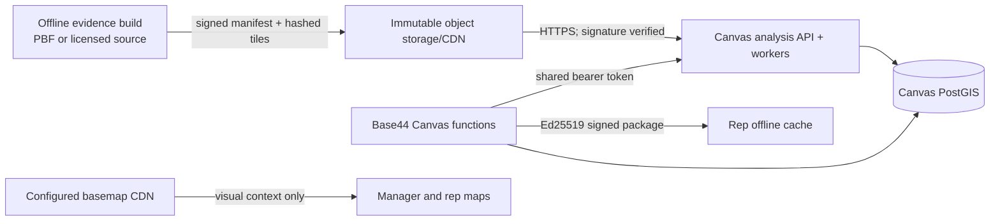

# FirstKnock Canvas national production runbook

This runbook is the release contract for the national Canvas architecture. Canvas plans are built from immutable, signed residential street evidence; deployed assignments and field decisions use a Canvas-only PostGIS database; reps receive signed offline packages; and map imagery is presentation only.

**Precision mode is unaffected.** Canvas does not read or write Precision property inventory, does not fall back to a Precision database URL, and does not change Precision routing or billing. Do not point `CANVAS_DATABASE_URL` at `DATABASE_URL` or `PRECISION_DATABASE_URL`.

## What these values are

These values do not come from the OpenStreetMap or Overpass websites. FirstKnock creates the secrets and signing keys, chooses an evidence artifact origin and basemap provider, and deploys the analysis service.



The signed manifest is the provider input. Its `sources[]` entries carry the provider, source ID, dataset version, capture time, and license. There is deliberately no production `CANVAS_EVIDENCE_PROVIDER` switch: a browser or request cannot select a provider or release.

## Deployment surfaces

### Base44 server secrets

Configure these in the Base44 server environment. Never prefix a server secret with `VITE_`.

| Variable | Required | Purpose |
|---|---:|---|
| `CANVAS_DATABASE_URL` | yes | Canvas-only PostgreSQL/PostGIS URL. Require TLS. It stores operational ownership, packages, decisions, DNC state, and manager summaries—not a source-house inventory. |
| `CANVAS_OPERATIONAL_MIGRATION_SECRET` | yes | Independent 32+ character authorization used only to run `setupCanvasOperationalStore`. |
| `CANVAS_DEPLOYMENT_SIGNING_SECRET` | yes | Independent 32+ character lifecycle-signing secret used by deployment, map, assignment, close, and integrity endpoints. |
| `CANVAS_ANALYSIS_SERVICE_URL` | yes | Credential-free HTTPS origin of the Canvas analysis API. Do not include a token in the URL. |
| `CANVAS_ANALYSIS_SERVICE_TOKEN` | yes | Independent 32+ character bearer token shared only by Base44 and the analysis service. |
| `CANVAS_PACKAGE_SIGNING_PRIVATE_KEY` | yes | Ed25519 private key used only by `canvasPublishAssignmentPackages`. Prefer base64 PKCS#8 DER. |
| `CANVAS_PACKAGE_SIGNING_PUBLIC_KEY` | yes | Matching Ed25519 public key used by server-side publication/retrieval integrity checks. Prefer base64 SPKI DER. It is not the rep app's trust source. |
| `CANVAS_PACKAGE_SIGNING_KEY_ID` | yes | Stable, non-secret key version such as `canvas-field-packages-2026-08`. |
| `CANVAS_PACKAGE_SIGNING_PRIVATE_KEY_FORMAT` | no | `pkcs8` by default; `jwk` is also supported. |
| `CANVAS_PACKAGE_SIGNING_PUBLIC_KEY_FORMAT` | no | `raw` by default. Set `spki` for the recommended DER export; `jwk` is also supported. |

Use [canvas-base44-secrets.example](./canvas-base44-secrets.example) as a name/format checklist only. Never put production values in the repository.

### Analysis service environment

Configure these on every Canvas analysis API/worker instance:

| Variable | Required | Purpose |
|---|---:|---|
| `CANVAS_DATABASE_URL` | yes | Durable PostgreSQL URL for queued jobs and immutable results. Use the same logical Canvas database as Base44, ideally through a separately scoped database role. |
| `CANVAS_ANALYSIS_SERVICE_TOKEN` | yes | Exactly the same bearer token configured in Base44. |
| `CANVAS_EVIDENCE_MANIFEST_URL` | yes | HTTPS, immutable, release-addressed manifest URL. Put the `cer1_…` release ID in the object path. |
| `CANVAS_EVIDENCE_MANIFEST_PUBLIC_KEY` | yes | Ed25519 SPKI public key in PEM or base64 DER. The offline evidence private key never goes on this service. |
| `CANVAS_EVIDENCE_MANIFEST_KEY_ID` | yes | Expected manifest key ID; it must equal `manifest.signature.key_id`. |
| `CANVAS_EVIDENCE_BEARER_TOKEN` | no | Read-only token for a private evidence origin. It is sent only to the manifest origin; signed tile paths must stay on that origin. |
| `CANVAS_SERVICE_MODE` | no | `both` for initial rollout; later use `api` and `worker` pools independently. |

Worker concurrency, leases, cache, and connection limits are listed in [the analysis-service README](../services/canvas-analysis-service/README.md). Start with the checked-in defaults, measure queue delay and database saturation, then change one bound at a time.

### Web build configuration

These are intentionally public Vite build values:

| Variable | Required | Purpose |
|---|---:|---|
| `VITE_CANVAS_BASEMAP_TILE_URL` | one basemap required | Contracted or self-hosted HTTPS XYZ template containing `{z}`, `{x}`, and `{y}`. Do not set it with the PMTiles URL. |
| `VITE_CANVAS_BASEMAP_PMTILES_URL` | one basemap required | Low-cost alternative: one HTTPS `.pmtiles` archive on R2/CDN. Do not set it with the XYZ URL. |
| `VITE_CANVAS_BASEMAP_PMTILES_FLAVOR` | no | Built-in vector style: `dark` (default), `light`, `white`, `grayscale`, or `black`. |
| `VITE_CANVAS_BASEMAP_ATTRIBUTION` | yes | Attribution required by the selected data/tile license. |
| `VITE_CANVAS_PACKAGE_SIGNING_PUBLIC_KEY` | yes | Ed25519 public key compiled into the app as the independent assignment-package trust anchor. It must exactly match the Base44 signer public key. |
| `VITE_CANVAS_PACKAGE_SIGNING_PUBLIC_KEY_FORMAT` | yes | `spki` for the recommended DER export; `raw` and `jwk` are also supported. |
| `VITE_CANVAS_PACKAGE_SIGNING_KEY_ID` | yes | Pinned signer key ID; it must exactly match `CANVAS_PACKAGE_SIGNING_KEY_ID`. |
| `VITE_CANVAS_SATELLITE_TILE_URL` | no | Optional contracted HTTPS XYZ satellite template. |
| `VITE_CANVAS_SATELLITE_ATTRIBUTION` | with satellite URL | Satellite-provider attribution. |

The PMTiles origin must support cross-origin HTTP Range requests, and the archive must use the Protomaps Basemap layer schema expected by the checked-in Leaflet renderer. Keep immutable archive versions so a rollback does not change bytes in place. The basemap cannot create work units, change territory ownership, or prove a house exists. Production intentionally renders no Canvas base tiles when the required base URL is absent. The development server may use its explicitly marked OpenStreetMap fallback.

## Provider policy

Public Overpass, the public OpenStreetMap tile service, and public Nominatim are **development-only** for Canvas. They have usage policies and availability characteristics that do not make them a production control plane for 50–200-person teams or continental coverage.

- Do not configure `CANVAS_OVERPASS_URL`, `CANVAS_OVERPASS_LARGE_AREA_URL`, `CANVAS_OVERPASS_AUTH_TOKEN`, `CANVAS_NOMINATIM_URL`, or `CANVAS_EVIDENCE_PROVIDER` on a production runtime.
- `CANVAS_ALLOW_PUBLIC_OVERPASS_FALLBACK` must be false or unset. That setting deliberately disables legacy v1 public street verification in production; legacy areas must be redrawn into signed residential v2 before activation. Set it true only in an explicitly isolated test/development environment.
- Build OSM-derived evidence offline from a licensed bulk extract (for example, a pinned regional/planet PBF), or use another licensed provider adapter. Publish only the compiled v1 manifest and tiles.
- Preserve source versions, capture timestamps, licenses, and required attribution in `manifest.sources[]`. OSM-derived releases must follow the ODbL and attribution obligations applicable to the produced database and service.
- Use a contracted/self-hosted geocoder for production Canvas search, or disable that convenience search. Public Nominatim is not a production dependency and is never evidence for residential opportunity or ownership.

The checked-in `compile-fixture.mjs` and fixture private key are test-only. A release signed by `firstknock-local-fixture-v1`, or a manifest containing a test-only source/license, must never be promoted.

## Generate independent secrets and keys

Run these in a secure operator environment. Save private material directly into the relevant secret manager; do not paste it into tickets, chat, logs, source control, or a browser field.

Generate three different symmetric secrets:

```sh
openssl rand -base64 48  # CANVAS_OPERATIONAL_MIGRATION_SECRET
openssl rand -base64 48  # CANVAS_DEPLOYMENT_SIGNING_SECRET
openssl rand -base64 48  # CANVAS_ANALYSIS_SERVICE_TOKEN
```

Generate the assignment-package key pair and export the encoding expected by the Base44 functions:

```sh
openssl genpkey -algorithm Ed25519 -out canvas-package-private.pem
openssl pkey -in canvas-package-private.pem -outform DER | openssl base64 -A
openssl pkey -in canvas-package-private.pem -pubout -outform DER | openssl base64 -A
```

Store the first encoded value as `CANVAS_PACKAGE_SIGNING_PRIVATE_KEY` with format `pkcs8`; store the second as `CANVAS_PACKAGE_SIGNING_PUBLIC_KEY` with format `spki`. Compile that exact second value and the exact same key ID into the web artifact as `VITE_CANVAS_PACKAGE_SIGNING_PUBLIC_KEY` and `VITE_CANVAS_PACKAGE_SIGNING_KEY_ID`. The public value is safe to distribute; its independent placement in the signed/deployed app is what prevents a compromised package response from substituting an attacker key. Delete the temporary private PEM securely after it is in the secret manager.

Generate a separate offline evidence-signing key pair. The private half belongs only in the offline release pipeline. Export only its SPKI public half to `CANVAS_EVIDENCE_MANIFEST_PUBLIC_KEY`. Never reuse assignment-package keys for evidence releases.

## Build and publish an evidence release

1. Pin the provider extract by version/checksum and retain its license record.
2. Run the production evidence adapter and v1 compiler offline. The output must classify short street/block-face work units as `opportunity`, `transit`, `uncertain`, or `excluded`; include address/building/access provenance; preserve complete protected cul-de-sac groups; and include symmetric topology.
3. Inspect density/size-limit failures. Do not raise signed contract limits without a reviewed load test.
4. Sign the canonical manifest with the offline Ed25519 evidence key.
5. Upload canonical tiles first, then the manifest, under an immutable path such as `/canvas/releases/<cer1_release_id>/manifest.json`. Enable object versioning/retention. Do not overwrite a release.
6. Keep every signed tile URI relative and on the same origin as the manifest. The service rejects cross-origin tile redirects and digest mismatches.
7. Download the promoted manifest through the same release path and run the readiness verifier with `--manifest-file` before changing the analysis-service environment.

The manifest public key authenticates the release; TLS authenticates the artifact origin; each signed tile entry pins byte length and SHA-256. All three checks are required.

## Validate configuration before deployment

The checker does not make network calls and never prints secret values. Run it independently in each deployment environment so secrets do not have to be copied into one place:

```sh
npm run validate:canvas:production -- --component base44
npm run validate:canvas:production -- --component analysis --manifest-file ./promoted-manifest.json
npm run validate:canvas:production -- --component web
```

An operator may run `--component all` in a secure ephemeral shell that contains all three configuration surfaces. A missing local manifest is reported as a warning; production promotion requires the second command above with the actual downloaded artifact. Any `BLOCKED` result stops the release.

The checker enforces:

- a TLS-required, non-local Canvas PostgreSQL URL that does not equal a visible Precision/general database URL;
- independent migration, lifecycle, and service secrets;
- HTTPS service/evidence/tile URLs without embedded credentials;
- a matching Ed25519 assignment-package key pair;
- a valid Ed25519 evidence public key and immutable `cer1_…` URL;
- manifest schema, provider metadata, US coverage, release path, key ID, and signature when a file is supplied;
- complete basemap/satellite URL-attribution pairs; and
- absence of live/public Canvas evidence fallbacks.

## First deployment order

1. Provision PostgreSQL 15+ with PostGIS, backups, point-in-time recovery, TLS, connection limits, and alerts. Create Canvas-specific credentials.
2. Configure Base44 secrets except the package private key on any environment that does not publish packages. Run the Base44 readiness profile.
3. Authenticate as a platform administrator and invoke `setupCanvasOperationalStore` with `x-canvas-migration-secret`. A successful receipt reports `canvas_operational_v2_lifecycle`, the twelve Canvas tables, and `precision_database_changed: false`. Store the sanitized receipt. This release must be applied even to a database that previously reported `canvas_operational_v1` because it adds the campaign closure and exact-successor tombstone columns.
4. Publish the signed evidence release and validate the downloaded manifest.
5. Deploy the analysis service container. Start with `CANVAS_SERVICE_MODE=both`; require TLS at the ingress and restrict origin access so only Base44/operator networks can reach non-health endpoints.
6. Confirm `GET <CANVAS_ANALYSIS_SERVICE_URL>/healthz` returns HTTP 200 and `{"ok":true}`. Health proves the service can reach its database; the staging analysis below proves evidence access and verification.
7. Configure the Base44 analysis URL/token, lifecycle secret, and package keys. Run the Base44 readiness profile again.
8. Configure the production web basemap values, build the exact artifact to deploy, and run the web readiness profile against that build environment.
9. Complete the authenticated staging gate below. Only then promote the identical service image and web artifact.

Do not deploy first and plan to add a missing secret later. Canvas endpoints are designed to fail closed, and partial setup produces the exact “street service unavailable” dead end this architecture replaces.

## Authenticated staging gate

Use a manager, two reps, and a test territory that contains residential streets, a cul-de-sac, an empty/non-residential pocket, and one intentionally uncertain unit.

1. Draw the boundary. Confirm one analysis job is created, progresses, and completes from the signed release without any browser Overpass request.
2. Confirm the map distinguishes residential opportunity, transit, uncertain, and excluded work. Empty fields/commercial-only units must contribute zero knocking workload.
3. Change the requested area count repeatedly. Confirm the same evidence ID/revision is reused and only the connected partition recalculates.
4. Confirm a protected cul-de-sac stays in one territory, every knock unit has exactly one owner, transit can connect territories without becoming knock workload, and excluded/uncertain units remain unowned.
5. Save an unassigned draft with amber units present. Confirm activation is blocked until every uncertain unit is reviewed, while draft/preview remains available.
6. Apply a reviewed classification, reload it by revision ID, and confirm the plan changes deterministically. Tamper with the snapshot/revision and confirm deploy fails without changing the campaign.
7. Assign two territories later, deploy, then publish packages. Confirm package versions increment and each rep can retrieve only their exact tenant/team/user/assignment package.
8. On a rep device, download and verify all required artifacts and the complete DNC snapshot. Go offline, add decisions, restart the app, and confirm map/territory/outbox state persists.
9. Reconnect. Confirm batches are idempotent, accepted decisions disappear from the outbox, retryable failures remain queued, permanent conflicts are visible, and cursor deltas update the rep without a full campaign download.
10. Add a DNC decision in one relevant assignment and confirm it propagates through the shared manager view and overlapping applicable rep scope before another knock.
11. Confirm manager summaries equal authoritative server counts and that a rep cannot read another rep’s package, submit outside owned work, cross tenants, reuse an idempotency key for different content, or bypass package expiry/revocation.
12. Repeat with a large representative boundary and the maximum intended team size. Record analysis queue time, peak worker memory, selected tile count/bytes, partition time, package bytes, sync latency, database connections, and manager-summary latency.
13. Run the normal Precision staging smoke and regression suite. Compare requests/writes to its baseline; Canvas must produce no Precision property ingestion, routing, or database mutation.

## Required automated gates

From the repository root:

```sh
node --test test/canvas-production-readiness.test.mjs
node --test test/canvas-evidence-contract.test.mjs
node --test services/canvas-analysis-service/test/service.test.mjs
node --test test/canvas-operational-migration.test.mjs test/canvas-operational-api.test.mjs
node --test test/canvas-offline-foundation.test.mjs
npm run typecheck
npm run validate:backend
npm run build
```

The repository’s complete deterministic test gate remains required. Authenticated Base44/PostGIS/evidence-origin smoke tests are environment tests and cannot be replaced by local mocks.

## Monitoring and capacity

Alert on analysis queue age, failed/retried jobs, lease churn, selected tile/byte limits, manifest/tile verification failures, database connection saturation, package publication size/failures, decision outbox age, sync rejection rate, cursor lag, DNC propagation lag, and manager-summary latency. Never log bearer tokens, database URLs, private keys, package contents, contact details, exact DNC addresses, or provider-controlled error bodies.

Initial rollout can run one `both` service with at least one warm standby. Before onboarding multiple 50–100-person teams, separate horizontally scaled API replicas from worker replicas, keep the database connection budget below the provider limit, cache the immutable manifest/tiles by digest, and load-test the real regional tile distribution. Scale workers from measured queue age, not just HTTP request count.

## Rotation and rollback

- **Evidence release:** never overwrite it. Drain or cancel queued jobs, publish a new immutable release, validate it, then atomically update manifest URL/public key/key ID and restart workers. Roll back by restoring the prior immutable URL and matching public key/key ID.
- **Analysis token:** update the service and Base44 in one maintenance window. Requests fail closed while values differ.
- **Assignment-package key:** publication/retrieval supports one active key. Stop publication, install the new pair/key ID, republish every active assignment to a new package version, verify device adoption, then let old signed packages expire. Do not delete offline data on a device until the replacement is verified.
- **Lifecycle secret:** the current lifecycle verifier has one secret, so rotating it would invalidate existing active campaigns. Close/redeploy campaigns in a controlled window or add a reviewed key-ring migration before rotating.
- **Database/service rollback:** stop new deployment/package publication first. Preserve append-only decisions and DNC rows. Restore application/service images before any schema rollback; the v1 migrations are additive and should normally remain.

If evidence verification, ownership integrity, DNC completeness, lifecycle signatures, or package signatures fail, block new activation/field work. Preserve manager boundaries, drafts, verified offline decisions, and immutable artifacts for diagnosis; never substitute square grids or an unsigned live road response.
